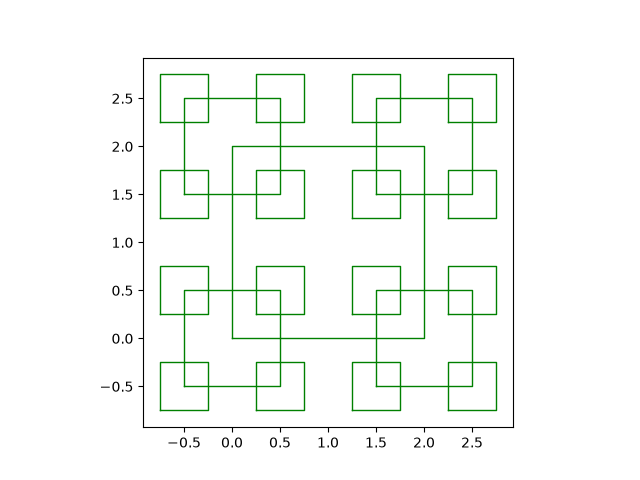

# El paquete recursion y el módulo rsquare

Esta práctica se estructura en forma de un paquete llamado `recursion` que contiene un módulo llamado `rsquare`. Dicho módulo implementará una clase llamada `RSquare` que representa una figura fractal basada en cuadrados.

***

## Actividad 1: Inicialización del paquete `recursion`

Abre una terminal Bash de Linux y sitúate en el directorio donde quieras mantener organizadas las prácticas de la asignatura (dentro de `$HOME/W` si estás en el escritorio DSIC-Linux de Polilabs). A continuación, crea el directorio de la práctica actual y sitúate en él:


```bash
mkdir p2
cd p2
```



Tened en cuenta que `p2` será nuestro directorio de trabajo de partida durante toda la práctica. Todos los ficheros y paquetes deberán estar organizados a partir de este directorio.


Ahora vamos a inicializar el paquete `recursion`. Crea el subdirectorio del paquete, e incluye en él un fichero `__init__.py` vacío con el comando `touch` para que Python lo reconozca como un paquete importable.


```bash
mkdir recursion
touch recursion/__init__.py # Creamos un fichero vacío
```


### Módulo `rsquare`

El módulo `rsquare` contendrá la clase `RSquare`, además de un `main` para probar la clase.

### Clase `RSquare`

#### Descripción de la clase

Un `RSquare` de orden $$n$$ se define por un cuadrado central de centro $$(x,y)$$, lado $$l$$, y color $$c$$, y cuatro instancias de `RSquare` de orden $$n-1$$ situados en sus esquinas (excepto si se trata de un cuadrado de orden 1, que es el caso base de la recursión). Por lo tanto, los 4 `RSquare` "hijos" tendrán lado $$l/2$$ y estarán situados en las esquinas del cuadrado central.

Esta clase encapsula tanto los datos (orden, tamaño, posición, color) como el comportamiento (cómo se construye la jerarquía y cómo se dibuja la figura en Matplotlib).

En el momento de crear una instancia de `RSquare`, se invocará un método **pseudo-recursivo** que construye la jerarquía de objetos `RSquare` descrita anteriormente. Posteriormente, cuando se pretenda dibujar el `RSquare` o guardarlo en un fichero, se invocará otro método **pseudo-recursivo** que recorrerá la jerarquía y dibujará cada `RSquare` en el objeto `Axes` de Matplotlib correspondiente. De esta forma, se separa la construcción de la jerarquía, del dibujado/renderizado de la misma.


Decimos que los métodos son **pseudo-recursivos** porque, si bien se invocarán sobre objetos `RSquare` distintos, y por tanto, técnicamente, desde el punto de vista de la programación, operan sobre contextos distintos, conceptualmente, desde el punto de vista de la geometría fractal, sí son recursivos.


#### Atributos

<table><thead><tr><th width="115.96875">Nombre</th><th width="143.35546875">Tipo</th><th width="120.84375">Visibilidad</th><th>Descripción</th></tr></thead><tbody><tr><td><code>order</code></td><td>de instancia</td><td>privado</td><td>Orden <span class="math">n</span> del <em>RSquare</em> <span class="math">(n \ge -1)</span>.</td></tr><tr><td><code>side</code></td><td>de instancia</td><td>privado</td><td>Longitud <span class="math">l</span> del <em>RSquare</em> <span class="math">(l > 0)</span>.</td></tr><tr><td><code>center</code></td><td>de instancia</td><td>privado</td><td>Tupla <code>(x, y)</code> con las coordenadas del centro del <em>RSquare</em>.</td></tr><tr><td><code>color</code></td><td>de instancia</td><td>privado</td><td>Color de las líneas del dibujo. Debe ser un string admitido por Matplotlib (<a href="https://matplotlib.org/stable/gallery/color/named_colors.html#base-colors">ver aquí</a>).</td></tr><tr><td><code>corners</code></td><td>de instancia</td><td>privado</td><td>Tupla que contiene las 4 instancias de <code>RSquare</code> de las esquinas.</td></tr></tbody></table>

#### Métodos

<table><thead><tr><th width="205.27734375">Perfil</th><th width="134.0859375">Visibilidad</th><th>Tipo</th><th>Descripción</th></tr></thead><tbody><tr><td><code>__init__(order, side, center, color)</code></td><td>-</td><td>Método constructor de instancia</td><td><p>Inicializa los atributos y valida que los datos de los atributos sean correctos, excepto para <code>color</code> (donde confiaremos en el usuario). </p><p></p><p>Si los datos no son correctos, lanzará un <code>ValueError</code>. </p><p></p><p>Dispara la construcción de la jerarquía recursiva llamando a <code>__init_recursive()</code>. </p><p></p><p>Por defecto, creará un <em>RSquare</em> de orden 2, lado 1, centrado en el origen y de color rojo.</p></td></tr><tr><td><code>order()</code></td><td>público</td><td>Propiedad consultora</td><td>Devuelve el orden de la figura.</td></tr><tr><td><code>side()</code></td><td>público</td><td>Propiedad consultora</td><td>Devuelve el lado del cuadrado</td></tr><tr><td><code>center()</code></td><td>público</td><td>Propiedad consultora</td><td>Devuelve la tupla del centro</td></tr><tr><td><code>color()</code></td><td>público</td><td>Propiedad consultora</td><td>Devuelve el color</td></tr><tr><td><code>show()</code></td><td>público</td><td>Método de instancia</td><td>Inicializa la figura (objeto <code>fig</code> de tipo <code>Figure</code>) y eje (objeto <code>ax</code> de tipo <code>Axes</code>) de Matplotlib (<a href="visualizacion-con-matplotlib.md">más info aquí</a>), llama a <code>__draw_recursive()</code> pasando el objeto <code>ax</code>, y finalmente muestra la figura por pantalla.</td></tr><tr><td><code>save(filename)</code></td><td>público</td><td>Método de instancia</td><td><p>Similar a <code>show()</code>, pero guarda la figura en el archivo <code>filename</code> en lugar de mostrarla por pantalla. </p><p></p><p><a href="visualizacion-con-matplotlib.md#guardando-la-figura-en-un-fichero">Más info aquí</a>.</p></td></tr><tr><td><code>init_recursive()</code></td><td>privado</td><td>Método de instancia</td><td>Método pseudo-recursivo que crea la jerarquía del <code>RSquare</code> : un <code>RSquare</code> de orden <br><span class="math">n</span> tiene un <code>RSquare</code> de orden <span class="math">n-1</span> en cada una de sus esquinas.</td></tr><tr><td><code>draw_recursive(ax)</code></td><td>privado</td><td>Método de instancia</td><td><p>Método pseudo-recursivo que dibuja el cuadrado actual en el objeto tipo <code>Axes</code> de Matplotlib proporcionado <code>ax</code> y delega el dibujado a los <code>RSquare</code> de las esquinas.</p><p> </p><p><a href="visualizacion-con-matplotlib.md#el-objeto-axes-y-la-delegacion-recursiva">Más info aquí</a>.</p></td></tr><tr><td><code>plot_square(ax, cx, cy, l)</code></td><td>privado</td><td>Método de instancia</td><td><p>Realiza la llamada efectiva a <code>ax.plot()</code> para dibujar un cuadrado de lado <code>l</code> centrado en (<code>cx</code>, <code>cy</code>).</p><p></p><p><a href="visualizacion-con-matplotlib.md">Más info aquí</a>.</p></td></tr></tbody></table>

***

## Actividad 2: Implementación de la clase RSquare

Implementa en el módulo `rsquare` la clase `RSquare`. Aquí tienes una plantilla mínima para guiarte:


```python
import matplotlib.pyplot as plt

class RSquare:
    """
    Clase que representa una figura RSquare (Recursive Square).
    Un RSquare de orden n se define como un cuadrado que tiene en sus cuatro
    esquinas otros RSquare de orden n-1 y lado la mitad del original.
    """

    pass
```



Recuerda que para que los cuadrados no se vean como rectángulos, debes configurar el aspecto de los ejes con `ax.set_aspect('equal')`.


***

## Actividad 3: Depuración

Añade el siguiente código **(SIN MODIFICAR)** al final del fichero `rsquare.py`:


NO MODIFICAR ESTE BLOQUE DE CÓDIGO PRINCIPAL

Su salida se podrá usar el día del examen para evaluaros.


<details>

<summary>Código de test</summary>


```python
if __name__ == "__main__":

    print("Intentando crear un rsquare con orden 0...")
    try:
        rs = RSquare(order=0)
    except ValueError as e:
        print(f"  > Se capturó excepción ValueError correctamente: {e}")

    print("Intentando crear un rsquare con orden negativo...")
    try:
        rs = RSquare(order=-1)
    except ValueError as e:
        print(f"  > Se capturó excepción ValueError correctamente: {e}")

    print("Intentando crear un rsquare con lado 0...")
    try:
        rs = RSquare(side=0)
    except ValueError as e:
        print(f"  > Se capturó excepción ValueError correctamente: {e}")

    print("Intentando crear un rsquare con lado negativo...")
    try:
        rs = RSquare(side=-1)
    except ValueError as e:
        print(f"  > Se capturó excepción ValueError correctamente: {e}")

    print("Intentando crear un rsquare con centro no tupla...")
    try:
        rs = RSquare(center="0,0")
    except ValueError as e:
        print(f"  > Se capturó excepción ValueError correctamente: {e}")

    print("Intentando crear un rsquare con centro de tupla no numerica (I)...")
    try:
        rs = RSquare(center=("0", "0"))
    except ValueError as e:
        print(f"  > Se capturó excepción ValueError correctamente: {e}")

    print("Intentando crear un rsquare con centro de tupla no numerica (II)...")
    try:
        rs = RSquare(center=(0, "0"))
    except ValueError as e:
        print(f"  > Se capturó excepción ValueError correctamente: {e}")

    print("Intentando crear un rsquare con centro de tupla con un elemento...")
    try:
        rs = RSquare(center=(0,))
    except ValueError as e:
        print(f"  > Se capturó excepción ValueError correctamente: {e}")

    print("Intentando crear un rsquare con centro de tupla con más de dos elementos...")
    try:
        rs = RSquare(center=(0,0,0))
    except ValueError as e:
        print(f"  > Se capturó excepción ValueError correctamente: {e}")

    # Generamos un RSquare de orden 4 en color azul
    rs = RSquare(order=3, side=2, center=(1,1), color="green")
    
    print(f"RSquare creado con éxito (Orden: {rs.order}, Color: {rs.color})")
    
    # Guardamos en PDF para comprobar la exportación
    rs.save("test_rsquare.pdf")
    print("Archivo 'test_rsquare.pdf' generado.")
    
    # Mostramos por pantalla
    rs.show()
```


</details>

Finalmente, úbicate en la raíz del proyecto (`p2`) y ejecuta el módulo `rsquare` como si fuera un script usando la opción `-m` del intérprete de Python:


```bash
python -m recursion.rsquare
```


Por un lado, en la terminal, deberías de generar una salida muy similar a esta:

<details>

<summary>Salida esperada</summary>


```bash
Intentando crear un rsquare con orden 0...
  > Se capturó excepción ValueError correctamente: El orden debe ser mayor o igual a 1.
Intentando crear un rsquare con orden negativo...
  > Se capturó excepción ValueError correctamente: El orden debe ser mayor o igual a 1.
Intentando crear un rsquare con lado 0...
  > Se capturó excepción ValueError correctamente: El lado debe ser positivo.
Intentando crear un rsquare con lado negativo...
  > Se capturó excepción ValueError correctamente: El lado debe ser positivo.
Intentando crear un rsquare con centro no tupla...
  > Se capturó excepción ValueError correctamente: El centro debe ser una tupla con dos elementos numéricos.
Intentando crear un rsquare con centro de tupla no numerica (I)...
  > Se capturó excepción ValueError correctamente: El centro debe ser una tupla con dos elementos numéricos.
Intentando crear un rsquare con centro de tupla no numerica (II)...
  > Se capturó excepción ValueError correctamente: El centro debe ser una tupla con dos elementos numéricos.
Intentando crear un rsquare con centro de tupla con un elemento...
  > Se capturó excepción ValueError correctamente: El centro debe ser una tupla con dos elementos numéricos.
Intentando crear un rsquare con centro de tupla con más de dos elementos...
  > Se capturó excepción ValueError correctamente: El centro debe ser una tupla con dos elementos numéricos.
RSquare creado con éxito (Orden: 3, Color: green)
Archivo 'test_rsquare.pdf' generado.
```


</details>

Si la semántica de tu salida es diferente a la esperada, revisa tu implementación.

Por otro lado, comprueba que se ha creado el archivo `test_rsquare.pdf` en tu directorio de trabajo y que se ha generado una ventana mostrando la figura. Debería tener el siguiente aspecto:

<figure><figcaption><p><em>RSquare</em> de orden 3 dibujado en verde.</p></figcaption></figure>
