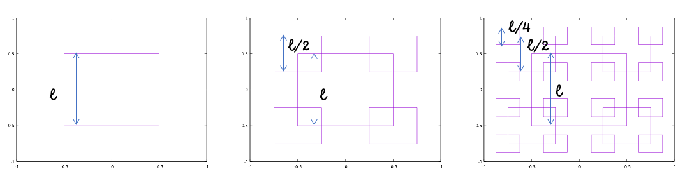

# RSquare: Definición recursiva

Un _RSquare_ es una figura geométrica plana que se obtiene mediante la repetición de un patrón básico: un cuadrado, en cuyas cuatro esquinas se pueden disponer otros cuadrados de lado la mitad del original. A su vez, en las esquinas de estos cuadrados más pequeños se pueden disponer otros cuadrados todavía más pequeños, y así sucesivamente. El número de veces $$n \ge 1$$ que se repite este patrón en el dibujo se denomina _orden_ de la figura. De momento, se considerará el tipo de figura denominado _RSquare_, que se define recursivamente de la forma siguiente:

* Un _RSquare_ de orden $$n = 1$$, lados de longitud $$l$$ y centro en el punto $$(x,y)$$, es un cuadrado de lado $$l$$ y centro en $$(x,y)$$.
* Un _RSquare_ de orden $$n > 1$$, lados de longitud $$l$$ y centro en el punto $$(x,y)$$, es un cuadrado de lado $$l$$ y centro en $$(x,y)$$, que tiene en cada una de sus cuatro esquinas o vértices un _RSquare_ de orden $$n-1$$, lados de longitud $$l/2$$ y centros en las esquinas correspondientes.

Por ejemplo, en la siguiente Figura se pueden ver figuras _RSquare_ de orden $$n=1$$, $$n = 2$$ y $$n = 3$$, todas ellas de la misma longitud $$l$$.

<figure><figcaption>
Figuras <em>RSquare</em> de longitud l y orden 1, 2 y 3, respectivamente.
</figcaption></figure>
