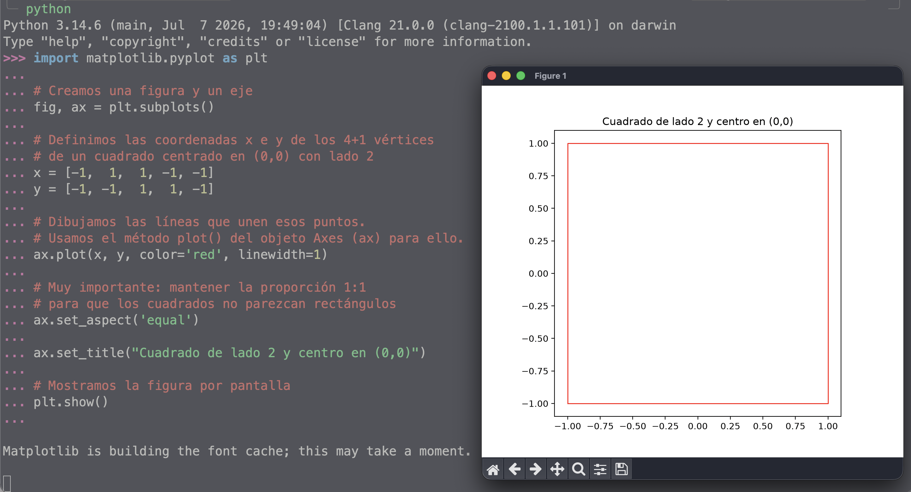
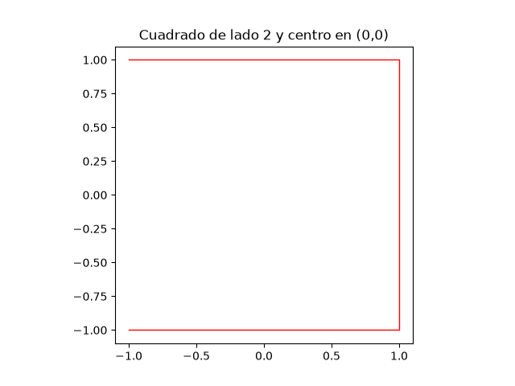
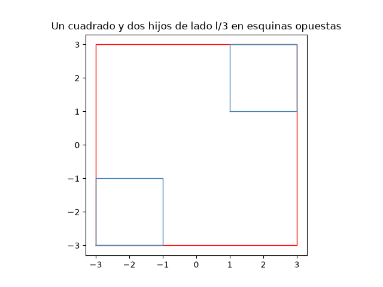

# Visualización con Matplotlib

La representación gráfica de los _RSquare_ se realizará utilizando **Matplotlib**, la librería estándar de facto para visualización en Python.

## Dibujando figuras geométricas con Matplotlib

Para dibujar figuras geométricas de forma programática, lo más habitual es utilizar el objeto `Axes` de Matplotlib. Un cuadrado se puede dibujar simplemente trazando las líneas que unen sus cuatro vértices en orden.

Para que Matplotlib dibuje un polígono cerrado, debemos proporcionarle dos listas con las coordenadas $$x$$ e $$y$$ respectivamente de todos sus vértices, repitiendo de nuevo las coordenadas del primer vértice al final de la lista.

A continuación, se muestra un ejemplo. Prueba a ejecutarlo con el intérprete interactivo de `python`:


```python
import matplotlib.pyplot as plt

# Creamos una figura y un eje
fig, ax = plt.subplots()

# Definimos las coordenadas x e y de los 4+1 vértices 
# de un cuadrado centrado en (0,0) con lado 2
x = [-1,  1,  1, -1, -1]
y = [-1, -1,  1,  1, -1]

# Dibujamos las líneas que unen esos puntos.
# Usamos el método plot() del objeto Axes (ax) para ello.
ax.plot(x, y, color='red', linewidth=1)

# Muy importante: mantener la proporción 1:1 
# para que los cuadrados no parezcan rectángulos
ax.set_aspect('equal')

ax.set_title("Cuadrado de lado 2 y centro en (0,0)")

# Mostramos la figura por pantalla
plt.show()
```


<figure><figcaption><p>Representación de un cuadrado de lado 2 y centro en (0,0) con Matplotlib.</p></figcaption></figure>


El uso de  `set_aspect('equal')` es fundamental aquí. Sin esta instrucción, Matplotlib ajustará los ejes para llenar la ventana, lo que deformará los cuadrados si la ventana no es perfectamente cuadrada.



Si no añadimos el quinto vértice repetido, la figura quedaría abierta.




***

## El objeto `Axes` y la delegación recursiva <a href="#el-objeto-axes-y-la-delegacion-recursiva" id="el-objeto-axes-y-la-delegacion-recursiva"></a>

Cada _RSquare_ será responsable de dibujarse a sí mismo usando un objeto `Axes` y de pedir a sus "hijos" (los _RSquare_ de las esquinas) que hagan lo mismo, pasándoles ese mismo objeto `Axes`.

<details>

<summary>Ejemplo</summary>

<figure><figcaption></figcaption></figure>


```python
import matplotlib.pyplot as plt

def draw_square(ax, cx, cy, side, color='red'):
    """Dibuja un cuadrado de lado 'side' centrado en (cx, cy)."""
    h = side / 2
    x = [cx - h, cx + h, cx + h, cx - h, cx - h]
    y = [cy - h, cy - h, cy + h, cy + h, cy - h]
    ax.plot(x, y, color=color, linewidth=1)

fig, ax = plt.subplots()

lado = 6
draw_square(ax, 0, 0, lado, color='red')

draw_square(ax, -2, -2, lado / 3, color='steelblue')
draw_square(ax,  2,  2, lado / 3, color='steelblue')

ax.set_aspect('equal')
ax.set_title("Un cuadrado y dos hijos de lado l/3 en esquinas opuestas")
plt.show()
```


</details>

***

## Guardando la figura en un fichero <a href="#guardando-la-figura-en-un-fichero" id="guardando-la-figura-en-un-fichero"></a>

En lugar de `plt.show()`, podemos utilizar `fig.savefig(nombre_fichero)` para guardar la figura en un fichero en el mismo directorio donde hemos ejecutado el programa. El formato del fichero vendrá determinado por la extensión del nombre del fichero (por ejemplo, `.png`, `.pdf`, `.svg`, etc.). Por ejemplo:

```python
# Guardamos la figura en un fichero PDF
fig.savefig("cuadrado.pdf")
# Cerramos la figura para liberar memoria
plt.close()
```

Notas:

* El método `savefig()` devuelve un booleano indicando si la operación fue exitosa.
* Conviene ejecutar `plt.close()` para liberar memoria si generamos muchas figuras.

***

## Límites del dibujo

Por las características de la definición de _RSquare_, una figura de orden $$n$$ (por elevado que sea este) y de lado $$l$$, se inscribe en un cuadrado de tamaño acotado de lado $$l + \frac{l}{2} + \frac{l}{2^2} + \cdots + \frac{l}{2^{n-1}} = 2l - \frac{l}{2^{n-1}}$$ y que en el límite vale $$2l$$ (ver demostración en el [Anexo 1](anexo-1-demostracion-del-tamano-de-un-rsquare-de-orden-n.md))&#x20;
